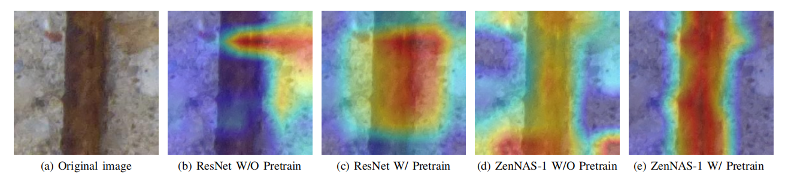

# Machine Learning - Project 2 (Team: Patricks)

In this repository, you can find our work for the Project 2 of the [Machine Learning](https://github.com/epfml/ML_course) at [EPFL](http://epfl.ch). We focus on the crack concrete classification problem as described [here](https://zenodo.org/record/2620293#.YZTqbr3MJqt), with the CODEBRIM dataset provided.

## A quick demo
To see a toy sample from our best trained model ZenNAS (75.6% multi-target accuracy) to predict different concrete defect images, simply run `run_sample.ipynb`. We have prepared the best weight (75.6%) for ZenNAS in this repo, you can directly use it at `model_scripts/hard_ZenNas_withPretrain.pth`. (the demo loads this weight by default)

## Reproduce the results

### Environment
Our project require `pytorch >= 1.6`, `Tensorflow == 1.4`. Linux and MacOS systems are preferred (you may encounter a file-path problem using Windows.)

Good news is we have packed all the environment in a docker file and upload it to dockerHub, you can find it [here](https://hub.docker.com/repository/docker/elenathfgs/pytorch1.6_cuda10.1_jupyter).

### Reproduce results for ENAS
* To search for the models (i.e., ENAS-1, ENAS-2, ENAS-3) please refer to `NAS_designed_model/enas.ipynb`.
* To train the ENAS generated models, you need to mannually extract the architecture description in training log, please refer it [here](https://github.com/melodyguan/enas).

### Reproduce results for EfficientNet
* Please refer to the code in `NAS_designed_model/train_crack_efficientNet.ipynb`.

### Reproduce results for ZenNAS
* Please refer to the code in `NAS_designed_model/train_crack_zenNAS.ipynb`.

### Reproduce results for baseline models
* Please refer to code in folder -- `expert_designed_model`.

## Contribution

1. We evaluate and compare expert designed and NAS generated CNN architectures for the multi-target concrete defect classification task, and obtain highly competitive result using ZenNAS with much less parameters compared to the expert-designed models.
2. Further, We show that cross-domain transfer learning could greatly boost the model performance, under which the ZenNAS model achieves best multi-target accuracy and surpassed the best result from MetaQNN in the original CODEBRIM paper (from 72.2\% to 75.6\%) 
3. We validate the performance gain using Grad-CAM to inspect attention pattern of last few convolutional layers, which shows that our transferred models' attention is better aligned with the defect area.

## Result

### Model Evaluation Results

Model evaluation results for multi-target and single-target scenarios. For each model, we report the best validation result, as well as the corresponding training and testing accuracy at the same epoch. Models with † are searched on ImageNet dataset while models with (*) are obtained from data-free zero-shot search.

### Attention Pattern of the Last Convolutional Layer

Grad-CAM attention pattern in last convolutional layer. For more examples please refer to the Appendix in our report.

### Transfer Learning Experiment Results
\
Pretrained models use weights from ImageNet dataset then retrain in CODEBRIM dataset.

## File structure of our project

.\
├── NAS_designed_model\
│   ├── EfficientNet_grid_search.ipynb\
│   ├── enas.ipynb\
│   ├── train_crack_efficientNet.ipynb\
│   └── train_crack_zenNAS.ipynb\
├── data_augmentation\
│   ├── data_analysis.ipynb\
│   ├── data_augmentation.ipynb\
│   └── datasets.py\
├── expert_designed_model\
│   ├── train_crack_resnet.ipynb\
│   └── train_crack_vgg.ipynb\
├── model_scripts\
│   ├── hard_ZenNas_withPretrain.pth\
│   ├── hard_ZenNas_withoutPretrain.pth\
├── sample\
│   ├── defects\
│   └── defects.xml\
├── tools\
│   ├── Image_banlance.pkl\
│   ├── NAS_result_analysis.ipynb\
│   ├── ZenNas_example.py\
│   ├── copy_balance.ipynb\
│   ├── datasets.py\
│   ├── focal_loss.py\
│   ├── model_acc_param.csv\
│   ├── result_analysis.ipynb\
├── README.md\
├── run_sample.ipynb\
├── ref_codes\
├── cam_test\
└── train_log

### `run_sample.ipynb`

A simple workflow using **ZenNAS-1** model as an example to get a quick overview of our project.

### `sample`

Include five sample pictures and labels 

### `NAS_designed_model`

Notebook scripts for training models of [ENAS](http://proceedings.mlr.press/v80/pham18a/pham18a.pdf), [ZenNas](https://openaccess.thecvf.com/content/ICCV2021/papers/Lin_Zen-NAS_A_Zero-Shot_NAS_for_High-Performance_Image_Recognition_ICCV_2021_paper.pdf), and [EfficientNet](https://arxiv.org/pdf/1905.11946.pdf). Also includes a script for conducting a grid search on hyper-parameters batchsize, patchsize, weight decay using EfficientNet.

### `Expert designed model`

Notebook scripts for training models of [ResNet](https://pytorch.org/hub/pytorch_vision_resnet/), [VGG](https://pytorch.org/hub/pytorch_vision_vgg/), [AlexNet](https://pytorch.org/hub/pytorch_vision_alexnet/), [DenseNet](https://pytorch.org/hub/pytorch_vision_densenet/).

### `Data Augmentation`

- **`data_analysis.ipynb`**:It includes our code for analyzing data distribution and resolution.
- **`datasets.py`**:To modify the transforms used in the dataloader, it includes 9 methods, such as RandomHorizontalFlip, RandomVerticalFlip, RandomRotation, RandomResizedCrop, RandomPerspective, GaussianBlur, RandomAdjustSharpness, random_select and normalize.
- **`data_augmentation.ipynb`**:In the training framework, we get data from dataloader that we modify in `datasets.py`.

### `model_scripts`

Including model structure produced by ZenNas method and parameter weight files.

### `tools`
- **`NAS_result_analysis.ipynb`**: It is used for analyzing the result of NAS like Agent Searching Reward.
- **`ZenNas_example.py`**:It includes functions for drawing and generating results in run_sample.ipynb.
- **`copy_balance.ipynb`**:It is the over-sampling method to address the problem of class imbalance.
- **`focal_loss.py`**:It implements focal loss to address the problem of class imbalance.
- **`result_analysis.py`**:It summarizes results and analyzes comprehensively with the accuracy rate and the number of model parameters.

### `ref_codes`
All the reference codes from other repositories used by this project:
- **`pytorch_grad_cam`**:It is an adjusted python package implementing [Grad_Cam](http://gradcam.cloudcv.org/).
- [**`ZenNAS`**](https://github.com/idstcv/ZenNAS):Code for ZenNAS search methods with imagenet-pretrained sample model path.  [Original Paper](https://arxiv.org/abs/2102.01063).
- [**`ENAS`**](https://github.com/melodyguan/enas):Code for ENAS search scripts. [Original Paper](https://arxiv.org/abs/1802.03268)

### `train_log`
It include almost all the training logs during our experiment as well as the tools to generate acc-loss curves during training.
